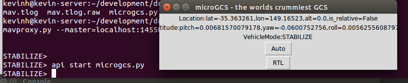

# ELC DroneAPI (DroneKit) tutorial

These are the notes for the live tutorial at Embedded Linux Conference 2015.  I'll be demonstrating these steps interactively at the conference so that you can reproduce this work on your own laptop with either a simulator or a real vehicle.

If you have questions after the conference please feel free to contact me at kevinh@geeksville.com.  Also, we can chat in the hallway after the talk.

The following notes correspond to the slides with the same titles.

## Lesson 0: Install the SDK

Run these commands in a _new_ xterm session.  They will pull down the APM source code, build a simulator image and then run it.  Since Vagrant pulls down a lot of code the first time you run these commands they will take quite some time.  At the end of this process you can leave this xterm running and do your droneapi work in a new window.

For more background on the SITL simulator and its installation see [Installing SITL using Vagrant](http://dev.ardupilot.com/wiki/simulation-2/sitl-simulator-software-in-the-loop/setting-up-sitl-using-vagrant/).

Note: We use vagrant to simplify the installation process.  If your laptop is running Linux (likely ;-)) you can eventually skip use of a VM to host the simulator.  This will result in much better performance and little CPU usage.  If you'd eventually like to do this somewhat more complex install see the instructions [here](http://dev.ardupilot.com/wiki/simulation-2/sitl-simulator-software-in-the-loop/setting-up-sitl-on-linux/).

### Commands to install prerequisites
```bash
# Install prerequisites
sudo apt-get install python-dev vagrant ssh virtualbox python-opencv python-wxgtk2.8

# droneapi and its MAVProxy container are both installed via PIP with
# the following command.
sudo pip install --upgrade droneapi

# We will use the ardupilot source to run our simulator in the next section
git clone https://github.com/diydrones/ardupilot.git

# We will be referring to some example code included in the git repository
git clone https://github.com/diydrones/dronekit-python.git

# We would like mavproxy to automatically load the DroneAPI module
# when it starts
echo "module load droneapi.module.api" >> ~/.mavinit.scr
```

### Commands to run the simulator
```bash
cd ardupilot

# This will fetch a lot of code to build your VM image and start things
# running.  If all goes well you'll eventually end up back at a shell prompt.
vagrant up

# This command actually connects to our running vagrant VM and asks
# it to start running
vagrant ssh -c "sim_vehicle.sh -w -j 2"

# Note: the -w parameter tells the simulator to init to a set of reasonable
# default parameters.  On future invocations you can omit this option for
# faster startup.

```

You should now be seeing the MAVProxy based debug shell which is used to monitor the state of the simulated vehicle:

```
Init ArduCopter V3.3-dev (6dcdddab)
Free RAM: 4096
FW Ver: 120

Firmware change: erasing EEPROM...
done.

STABILIZE> Mode STABILIZE
APM: Initialising APM...
APM: ArduCopter V3.3-dev (6dcdddab)
APM: Frame: QUAD
APM: Calibrating barometer
APM: barometer calibration complete
APM: GROUND START
Init Gyro**

Ready to FLY  ublox Received 451 parameters
fence breach
GPS lock at 0 meters
height 0
APM: PreArm: RC not calibrated
APM: PreArm: RC not calibrated
APM: PreArm: RC not calibrated
APM: PreArm: RC not calibrated

STABILIZE>
STABILIZE>
```

## Lesson 1: Go to a location

### Code to refer-to/use/edit

We will be running/editing [this](example/simple_goto/simple_goto.py) code.

### Commands to start MAVProxy

Launch the mavproxy shell (do this in a new window) that we will use to run our droneapi demo.

```bash

# We downloaded the droneapi-python repo earlier, to have access
# to the example code.
cd dronekit-python/example/simple_goto/

# Start mavproxy - connecting to the mavlink port in the simulator
mavproxy.py --master=localhost:14550 --map --console

# It is worth noting if you wanted to connect to a real vehicle rather than
# the simulator you would use a slightly different option:
# --master=/dev/ttyUSB0,57600
# See the links under "More Resources" for a tutorial showing how to connect
# an on vehicle coprocessor and run DroneAPI code in that environment.

```

At this point you should be inside a MAVProxy interactive shell.  You should see a map window showing the simulated vehicle sitting somewhere in Australia.

### Commands to run the example code

```
Connect localhost:14550 source_system=255
Logging to mav.tlog
Loaded module console
Loaded module map
DroneAPI loaded
Loaded module droneapi.module.api
Received 451 parameters

STABILIZE>
STABILIZE> api start simple_goto.py
Arming and taking off
timeout setting ARMING_CHECK to 0.000000
Taking off!
Going to second point...
APIThread-0 exiting...
```
When the above script runs you should see the simulated vehicle fly about on the map - between the two points we directed it to.

## Lesson 2: A (Ground Control Station) GCS in 50 lines

A ground control station is one of the most critical tools for managing a drone.  DroneAPI was constructed so it would have the basic building blocks needed to fully implement a basic GCS (or any other application you might desire).

### Code to refer-to/use/edit

We will be running/editing [this](example/gcs/microgcs.py) code.

### Commands to run
After launching MAVProxy (see previous lesson), just run "api start microgcs.py"

```
kevinh@kevin-server:~/development/drone/droneapi-python/example/gcs$ mavproxy.py --master=localhost:14550 --map --console
Logging to mav.tlog
Running script /home/kevinh/.mavinit.scr
DroneAPI loaded
Loaded module droneapi.module.api
Loaded module console
Loaded module map
STABILIZE> Received 451 parameters
STABILIZE> api start microgcs.py
```

You should then see our small crummy GUI:



Clicking on either of the two buttons should tell the vehicle to change flight modes.

## Doing this for real

* To avoid breaking your drone, probably best to fly with a new
friend the first few flights.  Try posting on www.diydrones.com to
find someone in your area.
* If you'd like to buy a pre-assembled drone, my recommendation is
[a 3DR Iris](https://store.3drobotics.com/products/iris).
* If you'd like to build a drone I recommend starting [here](http://copter.ardupilot.com/).  And then asking questions on diydrones as needed.
* For instructions on installing one possible co-processor inside the vehicle see [this](http://dev.ardupilot.com/wiki/companion-computers/odroid-via-mavlink/) page by Randy Mackay.
* Before flying either type of drone, reading this [first flight guide](http://copter.ardupilot.com/wiki/flying-arducopter/) is wise.
* Always have your GCS (Droidplanner, Mission Planner, APM Planner etc...) connected to the vehicle while testing any advanced behaviors.
* If you are having your custom code talk to a real (non simulated)
vehicle it is best to have a safety pilot.  Let that person use the RC controller while you monitor the code.  If anything seems wrong they should be ready to turn the "mode switch" to "position hold" or some other non automated flight mode.

## More resources / Next steps

* [@mrpollo](https://github.com/mrpollo) and [@kaitlynhova](https://github.com/kaitlynhova) have prepared a very nice site with more tutorials and our python documentation at [python.dronekit.io](http://python.dronekit.io/).  
