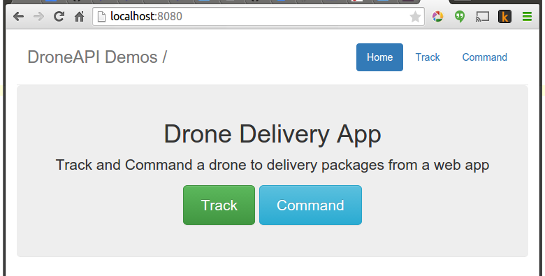

===========================
Example: Drone Delivery
===========================

This example shows how to create a `CherryPy <http://www.cherrypy.org>`_ based web application that 
displays a mapbox map to let you view the current vehicle position and send the vehicle commands 
to fly to a particular latitude and longitude.

New functionality demonstrated by this example includes:

* Using attribute observers to be notified of vehicle state changes.
* Starting *CherryPy* from a DroneKit application.

Running the example
===================

The example can be run much as described in :doc:`running_examples` (which in turn assumes that the vehicle
and DroneKit have been set up as described in :ref:`installing_dronekit`). The main exception is that you need to 
install the CherryPy dependencies and view the behaviour in a web browser.

In summary, after cloning the repository:

#. Navigate to the example folder as shown:

   .. code-block:: bash

       cd dronekit-python\examples\drone_delivery\

#. Install *CherryPy* and any other dependencies from **requirements.pip** in that directory:

   .. code-block:: bash

       pip install -r requirements.pip
       
#. You can run the example against the simulator by specifying the Python script without any arguments.
   The example will download and start DroneKit-SITL, and then connect to it:

   .. code-block:: bash

       python drone_delivery.py

   On the command prompt you should see (something like):

   .. code:: bash

       >python drone_delivery.py
       
       D:\Github\dronekit-python\examples\drone_delivery>drone_delivery.py
       Starting copter simulator (SITL)
       SITL already Downloaded.
       local path: D:\Github\dronekit-python\examples\drone_delivery
       Connecting to vehicle on: tcp:127.0.0.1:5760
       >>> APM:Copter V3.3 (d6053245)
       >>> Frame: QUAD
       >>> Calibrating barometer
       >>> Initialising APM...
       >>> barometer calibration complete
       >>> GROUND START
       Launching Drone...
       [DEBUG]: Connected to vehicle.
       [DEBUG]: DroneDelivery Start
       [DEBUG]: Waiting for location...
       [DEBUG]: Waiting for ability to arm...
       [DEBUG]: Running initial boot sequence
       [DEBUG]: Changing to mode: GUIDED
       [DEBUG]:   ... polled mode: GUIDED
       [DEBUG]: Waiting for arming...
       >>> ARMING MOTORS
       >>> GROUND START
       >>> Initialising APM...
       [DEBUG]: Taking off
       http://localhost:8080/
       Waiting for cherrypy engine...

#. You can run the example against a specific connection (simulated or otherwise) by passing the :ref:`connection string <get_started_connect_string>` for your vehicle in the ``--connect`` parameter. 
   For example, to connect to Solo:

   .. code-block:: bash

       python drone_delivery.py --connect udpin:0.0.0.0:14550

#. After a short while you should be able to reach your new webserver at http://localhost:8080.  
   Navigate to the **Command** screen, select a target on the map, then select **Go**. 
   The command prompt will show something like the message below. 
    
   .. code-block:: bash

       [DEBUG]: Goto: [u'-35.4', u'149.2'], 29.98
    
   The web server will switch you to the **Track** screen. You can view the vehicle progress by pressing the 
   **Update** button.

Screenshots
===========

The webserver (http://localhost:8080) will look like the following:

.. image:: drone-delivery-track.png

.. image:: drone-delivery-command.png

How it works
============

Using attribute observers
-------------------------

All attributes in DroneKit can have observers - this is the primary mechanism you should use to be notified of changes in vehicle state.  
For instance, `drone_delivery.py <https://github.com/dronekit/dronekit-python/blob/master/examples/drone_delivery/drone_delivery.py>`_ calls:

.. code-block:: python

    self.vehicle.add_attribute_listener('location', self.location_callback)

    ...

    def location_callback(self, vehicle, name, location):
        if location.global_relative_frame.alt is not None:
            self.altitude = location.global_relative_frame.alt

        self.current_location = location.global_relative_frame

This results in DroneKit calling our ``location_callback`` method any time the location attribute gets changed.

.. tip:: 

    It is also possible (and often more elegant) to add listeners using a decorator 
    - see :py:func:`Vehicle.on_attribute <dronekit.Vehicle.on_attribute>`.

Starting CherryPy from a DroneKit application
---------------------------------------------

We start running a web server by calling ``cherrypy.engine.start()``.

*CherryPy* is a very small and simple webserver.  It is probably best to refer to their eight line `tutorial <http://www.cherrypy.org/>`_ for more information.

Known issues
============

This example has the following issues:

* `#537: Dronekit delivery tracking needs to zoom and also ideally auto update <https://github.com/dronekit/dronekit-python/issues/537>`_ 
* `#538: Dronekit delivery example does not exit <https://github.com/dronekit/dronekit-python/issues/538>`_

Source code
===========

The full source code at documentation build-time is listed below (`current version on github <https://github.com/dronekit/dronekit-python/blob/master/examples/drone_delivery/drone_delivery.py>`_):

.. include:: ../../examples/drone_delivery/drone_delivery.py
    :literal:
