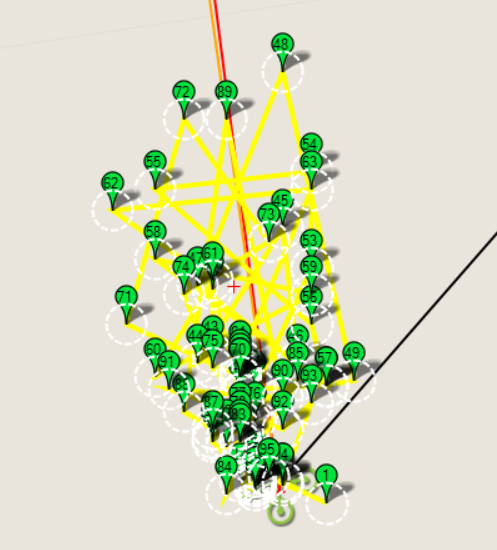

======================
Example: Flight Replay
======================

This example creates and runs a waypoint mission using position information from a TLOG file.

The log used in this example contains around 2700 points. This is too many points to upload
to the autopilot (and to usefully display). Instead we only add points that are more than 
3 metres away from the previously kept point, and only store 99 points in total. 
After 60 seconds the mission is ended by setting the mode to RTL (return to launch).

    99 point mission generated from log

.. note::

    The method used to reduce the number of points is fairly effective, but we
    could do better by grouping some of the waypoints, and mapping others using
    spline waypoints. This might be a 
    `fun research project <https://github.com/dronekit/dronekit-python/issues/561>`_!

Running the example
===================

The example can be run as described in :doc:`running_examples` (which in turn assumes that the vehicle
and DroneKit have been set up as described in :ref:`installing_dronekit`). 

In summary, after cloning the repository:

#. Navigate to the example folder as shown:

   .. code-block:: bash

       cd dronekit-python/examples/flight_replay/
       
#. You can run the example against a simulator (DroneKit-SITL) by specifying the Python script without any arguments. 
   The example will download SITL binaries if needed, start the simulator, and then connect to it:

   .. code-block:: bash

       python flight_replay.py

   On the command prompt you should see (something like):
   
   .. code:: bash

       Generating waypoints from tlog...
        Generated 100 waypoints from tlog
       Starting copter simulator (SITL)
       SITL already Downloaded.
       Connecting to vehicle on: tcp:127.0.0.1:5760
       >>> APM:Copter V3.3 (d6053245)
       >>> Frame: QUAD
       >>> Calibrating barometer
       >>> Initialising APM...
       >>> barometer calibration complete
       >>> GROUND START
       Uploading 100 waypoints to vehicle...
       Arm and Takeoff
        Waiting for vehicle to initialise...
       >>> flight plan received
        Waiting for arming...
        Waiting for arming...
        Waiting for arming...
        Waiting for arming...
       >>> ARMING MOTORS
       >>> GROUND START
        Waiting for arming...
       >>> Initialising APM...
        Waiting for arming...
       >>> ARMING MOTORS
        Taking off!
        Altitude: 0.000000 < 28.500000
        Altitude: 0.010000 < 28.500000
        ...
        Altitude: 26.350000 < 28.500000
        Altitude: 28.320000 < 28.500000
        Reached target altitude of ~30.000000
       Starting mission
       Distance to waypoint (1): 3.02389745499
       >>> Reached Command #1
       Distance to waypoint (2): 5.57718471895
       Distance to waypoint (2): 4.1504263025
       >>> Reached Command #2
       Distance to waypoint (3): 0.872847106279
       Distance to waypoint (3): 1.88967925144
       Distance to waypoint (3): 2.16157704522
       >>> Reached Command #3
       Distance to waypoint (4): 4.91867197924
       ...
       ...
       Distance to waypoint (35): 4.37309981133
       >>> Reached Command #35
       Distance to waypoint (36): 5.61829417257
       >>> Reached Command #36
       Return to launch
       Close vehicle object
       Completed...

   .. tip::
       It is more interesting to watch the example run on a map than the console. The topic :ref:`viewing_uav_on_map` 
       explains how to set up *Mission Planner* to view a vehicle running on the simulator (SITL).
       
#. You can run the example against a specific connection (simulated or otherwise) by passing the :ref:`connection string <get_started_connect_string>` for your vehicle in the ``--connect`` parameter. 

   For example, to connect to SITL running on UDP port 14550 on your local computer:

   .. code-block:: bash

       python simple_goto.py --connect 127.0.0.1:14550
       

       
How it works
============

Getting the points
------------------

The example parses the **flight.tlog** file for position information. First we read all the points. 
We then keep the first 99 points that are at least 3 metres separated from the preceding kept point.

For safety reasons, the altitude for the waypoints is set to 30 meters (irrespective of the recorded height).

.. code:: python

    def position_messages_from_tlog(filename):
        """
        Given telemetry log, get a series of wpts approximating the previous flight
        """
        # Pull out just the global position msgs
        messages = []
        mlog = mavutil.mavlink_connection(filename)
        while True:
            try:
                m = mlog.recv_match(type=['GLOBAL_POSITION_INT'])
                if m is None:
                    break
            except Exception:
                break
            # ignore we get where there is no fix:
            if m.lat == 0:
                continue
            messages.append(m)

        # Shrink the number of points for readability and to stay within autopilot memory limits. 
        # For coding simplicity we:
        #   - only keep points that are with 3 metres of the previous kept point.
        #   - only keep the first 100 points that meet the above criteria.
        num_points = len(messages)
        keep_point_distance=3 #metres
        kept_messages = []
        kept_messages.append(messages[0]) #Keep the first message
        pt1num=0
        pt2num=1
        while True:
            #Keep the last point. Only record 99 points.
            if pt2num==num_points-1 or len(kept_messages)==99:
                kept_messages.append(messages[pt2num])
                break
            pt1 = LocationGlobalRelative(messages[pt1num].lat/1.0e7,messages[pt1num].lon/1.0e7,0)
            pt2 = LocationGlobalRelative(messages[pt2num].lat/1.0e7,messages[pt2num].lon/1.0e7,0)
            distance_between_points = get_distance_metres(pt1,pt2)
            if distance_between_points > keep_point_distance:
                kept_messages.append(messages[pt2num])
                pt1num=pt2num
            pt2num=pt2num+1

        return kept_messages

Setting the new waypoints
-------------------------

The following code shows how the vehicle writes the received messages as commands (this part of the code is very similar to that
shown in :ref:`example_mission_basic`):

.. code:: python

    print "Generating %s waypoints from replay..." % len(messages)
    cmds = vehicle.commands
    cmds.clear()
    for i in xrange(0, len(messages)):
        pt = messages[i]
        lat = pt['lat']
        lon = pt['lon']
        # To prevent accidents we don't trust the altitude in the original flight, instead
        # we just put in a conservative cruising altitude.
        altitude = 30.0 # pt['alt']
        cmd = Command( 0,
                       0,
                       0,
                       mavutil.mavlink.MAV_FRAME_GLOBAL_RELATIVE_ALT,
                       mavutil.mavlink.MAV_CMD_NAV_WAYPOINT,
                       0, 0, 0, 0, 0, 0,
                       lat, lon, altitude)
        cmds.add(cmd)
    #Upload clear message and command messages to vehicle.
    cmds.upload()

Known issues
============

There are no known issues with this example.

  

Source code
===========

The full source code at documentation build-time is listed below (`current version on github <https://github.com/dronekit/dronekit-python/blob/master/examples/flight_replay/flight_replay.py>`_):

.. literalinclude:: ../../examples/flight_replay/flight_replay.py
   :language: python
