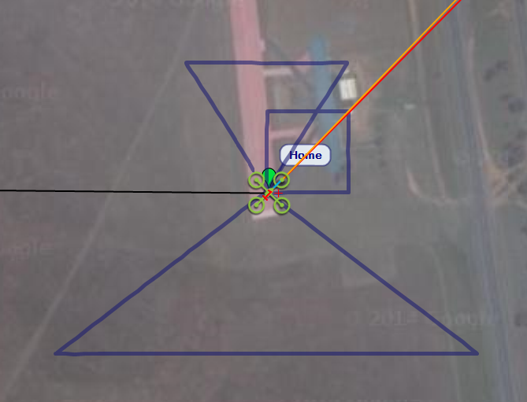
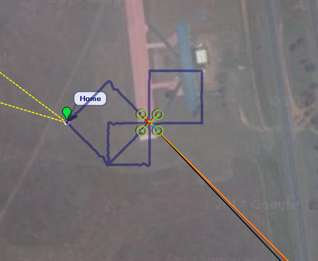

.. _example-guided-mode-setting-speed-yaw:

===================================================
Example: Guided Mode Movement and Commands (Copter)
===================================================

This example shows how to control Copter movement and send immediate commands in :ref:`GUIDED mode <guided_mode_copter>`. 
It demonstrates three methods for explicitly specifying a target position and two commands for controlling movement by 
setting the vehicle's velocity vectors. It also shows how to send commands to control the yaw (direction that the front 
of the vehicle is pointing), region of interest, speed and home location, along with some useful functions for 
converting between frames of reference.

The example is :ref:`documented in the source code <guided_example_source_code>`. 
More detailed information about using GUIDED mode can be found in the guide: :ref:`guided_mode_copter`.

   Setting destination using position and changing speed and ROI

   

   Setting destination using velocity and changing yaw and home location

Running the example
===================

The example can be run as described in :doc:`running_examples` (which in turn assumes that the vehicle
and DroneKit have been set up as described in :ref:`installing_dronekit`).

In summary, after cloning the repository:

#. Navigate to the example folder as shown:

   .. code-block:: bash

       cd dronekit-python/examples/guided_set_speed_yaw/

#. You can run the example against a simulator (DroneKit-SITL) by specifying the Python script without any arguments.
   The example will download SITL binaries if needed, start the simulator, and then connect to it:

   .. code-block:: bash

       python guided_set_speed_yaw.py

   On the command prompt you should see (something like):
   
   .. code:: bash

       Starting copter simulator (SITL)
       SITL already Downloaded.
       Connecting to vehicle on: tcp:127.0.0.1:5760
       >>> APM:Copter V3.3 (d6053245)
       >>> Frame: QUAD
       >>> Calibrating barometer
       >>> Initialising APM...
       >>> barometer calibration complete
       >>> GROUND START
       Basic pre-arm checks
        Waiting for vehicle to initialise...
        ...
        Waiting for vehicle to initialise...
       Arming motors
        Waiting for arming...
        ...
        Waiting for arming...
       >>> ARMING MOTORS
       >>> GROUND START
        Waiting for arming...
       >>> Link timeout, no heartbeat in last 5 seconds
       >>> ...link restored.
       >>> Initialising APM...
       Taking off!
        Altitude:  0.0
        Altitude:  0.28
        ...
        Altitude:  4.76
       Reached target altitude
       TRIANGLE path using standard Vehicle.simple_goto()
       Set groundspeed to 5m/s.
       Position North 80 West 50
       Distance to target:  100.792763565
       Distance to target:  99.912599325
       ...
       Distance to target:  1.21731863826
       Distance to target:  0.846001925791
       Reached target
       Position North 0 East 100
       Distance to target:  122.623210813
       ...
       Distance to target:  4.75876224557
       Distance to target:  0.244650555031
       Reached target
       Position North -80 West 50
       Distance to target:  100.792430814
       Distance to target:  100.592652053
       ...
       Distance to target:  2.48849019535
       Distance to target:  0.73822537077
       Reached target
       TRIANGLE path using standard SET_POSITION_TARGET_GLOBAL_INT message and with varying speed.
       Position South 100 West 130
       Set groundspeed to 5m/s.
       Distance to target:  188.180927131
       Distance to target:  186.578341133
       ...
       Distance to target:  9.87090024758
       Distance to target:  1.4668164732
       Reached target
       Set groundspeed to 15m/s (max).
       Position South 0 East 200
       Distance to target:  318.826732298
       Distance to target:  320.787965033
       ...
       Distance to target:  11.5626483964
       Distance to target:  0.335164775811
       Reached target
       Set airspeed to 10m/s (max).
       Position North 100 West 130
       Distance to target:  188.182420209
       Distance to target:  189.860730713
       ...
       Distance to target:  10.4263414971
       Distance to target:  1.29857175712
       Reached target
       SQUARE path using SET_POSITION_TARGET_LOCAL_NED and position parameters
       North 50m, East 0m, 10m altitude for 20 seconds
       Point ROI at current location (home position)
       North 50m, East 50m, 10m altitude
       Point ROI at current location
       North 0m, East 50m, 10m altitude
       North 0m, East 0m, 10m altitude
       SQUARE path using SET_POSITION_TARGET_LOCAL_NED and velocity parameters
       Yaw 180 absolute (South)
       Velocity South & up
       Yaw 270 absolute (West)
       Velocity West & down
       Yaw 0 absolute (North)
       Velocity North
       Yaw 90 absolute (East)
       Velocity East
       DIAMOND path using SET_POSITION_TARGET_GLOBAL_INT and velocity parameters
       Yaw 225 absolute
       Velocity South, West and Up
       Yaw 90 relative (to previous yaw heading)
       Velocity North, West and Down
       Set new home location to current location
       Get new home location
        Home Location: LocationGlobal:lat=-35.363243103,lon=149.164337158,alt=593.890014648
       Yaw 90 relative (to previous yaw heading)
       Velocity North and East
       Yaw 90 relative (to previous yaw heading)
       Velocity South and East
       Setting LAND mode...
       Close vehicle object
       Completed

   .. tip::

       It is more interesting to watch the example run on a map than the console. The topic :ref:`viewing_uav_on_map` 
       explains how to set up *Mission Planner* to view a vehicle running on the simulator (SITL).
       
#. You can run the example against a specific connection (simulated or otherwise) by passing the :ref:`connection string <get_started_connect_string>` for your vehicle in the ``--connect`` parameter. 

   For example, to connect to SITL running on UDP port 14550 on your local computer:

   .. code-block:: bash

       python guided_set_speed_yaw.py --connect 127.0.0.1:14550  

How does it work?
=================

The example is :ref:`documented in source code <guided_example_source_code>`. Additional information on the methods is provided either below or :ref:`in the guide <guided_mode_copter>`.

The functions for controlling vehicle movement are:

* :ref:`Vehicle.simple_goto() <guided_mode_copter_position_control>` is the standard 
  DroneKit position controller method. It is called from :ref:`goto <example_guided_mode_goto_convenience>` to fly a triangular path.
* :ref:`goto_position_target_global_int() <example_guided_mode_goto_position_target_global_int>` 
  is a position controller that uses the 
  `SET_POSITION_TARGET_GLOBAL_INT <https://pixhawk.ethz.ch/mavlink/#SET_POSITION_TARGET_GLOBAL_INT>`_ command.
* :ref:`goto_position_target_local_ned() <example_guided_mode_goto_position_target_local_ned>` 
  is a position controller that uses `SET_POSITION_TARGET_LOCAL_NED <https://pixhawk.ethz.ch/mavlink/#SET_POSITION_TARGET_LOCAL_NED>`_ 
  command (taking values in NED frame, relative to the home position). This is used to fly a square path. 
  The script is put to sleep for a certain time in order to allow the vehicle to reach the specified position.
* :ref:`send_ned_velocity() <guided_mode_copter_velocity_control>` is a velocity controller. 
  It uses `SET_POSITION_TARGET_LOCAL_NED <https://pixhawk.ethz.ch/mavlink/#SET_POSITION_TARGET_LOCAL_NED>`_ 
  to fly a square path using velocity vectors to define the speed in each direction. 
* :ref:`send_global_velocity() <example_guided_mode_send_global_velocity>` is a velocity controller. 
  It uses `SET_POSITION_TARGET_GLOBAL_INT <https://pixhawk.ethz.ch/mavlink/#SET_POSITION_TARGET_GLOBAL_INT>`_ 
  to fly a diamond-shaped path. The behaviour is essentially the same as for ``send_ned_velocity()`` 
  because the velocity components in both commands are in the NED frame.
* :ref:`goto <example_guided_mode_goto_convenience>` is a convenience function for specifying a target location 
  in metres from the current location and reporting the result. 

The functions sending immediate commands are:

* :ref:`condition_yaw() <guided_mode_copter_set_yaw>` 
* :ref:`set_roi(location) <guided_mode_copter_set_roi>`

The example uses a number functions to convert global locations co-ordinates (decimal degrees) into local 
coordinates relative to the vehicle (in metres). These are :ref:`described in the guide <guided_mode_copter_useful_conversion_functions>`.

.. _example_guided_mode_goto_convenience:

goto() - convenience function
-----------------------------

This is a convenience function for setting position targets in metres North and East of the current location. 
It reports the distance to the target every two seconds and completes when the target is reached.

This takes a function argument of either :ref:`Vehicle.simple_goto() <guided_mode_copter_position_control>` or 
:ref:`goto_position_target_global_int() <example_guided_mode_goto_position_target_global_int>`

.. code-block:: python

    def goto(dNorth, dEast, gotoFunction=vehicle.simple_goto):
        currentLocation=vehicle.location.global_relative_frame
        targetLocation=get_location_metres(currentLocation, dNorth, dEast)
        targetDistance=get_distance_metres(currentLocation, targetLocation)
        gotoFunction(targetLocation)

        while vehicle.mode.name=="GUIDED": #Stop action if we are no longer in guided mode.
            remainingDistance=get_distance_metres(vehicle.location.global_frame, targetLocation)
            print "Distance to target: ", remainingDistance
            if remainingDistance<=targetDistance*0.01: #Just below target, in case of undershoot.
                print "Reached target"
                break;
            time.sleep(2)

.. _example_guided_mode_send_ned_velocity:

send_ned_velocity()
-------------------

The function ``send_ned_velocity()`` generates a ``SET_POSITION_TARGET_LOCAL_NED`` MAVLink message 
which is used to directly specify the speed components of the vehicle. 

The message is resent at 1Hz for a set duration.

This is documented in :ref:`the guide here <guided_mode_copter_velocity_control>`.

.. _example_guided_mode_send_global_velocity:

send_global_velocity()
----------------------

The function ``send_global_velocity()`` generates a 
`SET_POSITION_TARGET_GLOBAL_INT <https://pixhawk.ethz.ch/mavlink/#SET_POSITION_TARGET_GLOBAL_INT>`_ 
MAVLink message which is used to directly specify the speed components of the vehicle in the NED
frame.

The function behaviour is otherwise exactly the same as when using 
:ref:`SET_POSITION_TARGET_LOCAL_NED <guided_mode_copter_velocity_control>`.

.. code-block:: python

    def send_global_velocity(velocity_x, velocity_y, velocity_z, duration):
        """
        Move vehicle in direction based on specified velocity vectors.
        """
        msg = vehicle.message_factory.set_position_target_global_int_encode(
            0,       # time_boot_ms (not used)
            0, 0,    # target system, target component
            mavutil.mavlink.MAV_FRAME_GLOBAL_RELATIVE_ALT_INT, # frame
            0b0000111111000111, # type_mask (only speeds enabled)
            0, # lat_int - X Position in WGS84 frame in 1e7 * meters
            0, # lon_int - Y Position in WGS84 frame in 1e7 * meters
            0, # alt - Altitude in meters in AMSL altitude(not WGS84 if absolute or relative)
            # altitude above terrain if GLOBAL_TERRAIN_ALT_INT
            velocity_x, # X velocity in NED frame in m/s
            velocity_y, # Y velocity in NED frame in m/s
            velocity_z, # Z velocity in NED frame in m/s
            0, 0, 0, # afx, afy, afz acceleration (not supported yet, ignored in GCS_Mavlink)
            0, 0)    # yaw, yaw_rate (not supported yet, ignored in GCS_Mavlink) 

        # send command to vehicle on 1 Hz cycle
        for x in range(0,duration):
            vehicle.send_mavlink(msg)
            time.sleep(1)

.. note::

    The message is re-sent every second for the specified duration. From Copter 3.3 the vehicle will stop 
    moving if a new message is not received in approximately 3 seconds. Prior to Copter 3.3 the message only
    needs to be sent once, and the velocity remains active until the next movement message is received. 
    The above code works for both cases!

.. _example_guided_mode_goto_position_target_global_int:

goto_position_target_global_int()
---------------------------------

The function ``goto_position_target_global_int()`` generates a 
`SET_POSITION_TARGET_GLOBAL_INT <http://dev.ardupilot.com/wiki/copter-commands-in-guided-mode/#set_position_target_global_int>`_ 
MAVLink message which is used to directly specify the target location of the vehicle. 
When used with ``MAV_FRAME_GLOBAL_RELATIVE_ALT_INT`` as shown below, 
this method is effectively the same as :ref:`Vehicle.simple_goto <guided_mode_copter_position_control>`.

.. code-block:: python

    def goto_position_target_global_int(aLocation):
        """
        Send SET_POSITION_TARGET_GLOBAL_INT command to request the vehicle fly to a specified location.
        """
        msg = vehicle.message_factory.set_position_target_global_int_encode(
            0,       # time_boot_ms (not used)
            0, 0,    # target system, target component
            mavutil.mavlink.MAV_FRAME_GLOBAL_RELATIVE_ALT_INT, # frame
            0b0000111111111000, # type_mask (only speeds enabled)
            aLocation.lat*1e7, # lat_int - X Position in WGS84 frame in 1e7 * meters
            aLocation.lon*1e7, # lon_int - Y Position in WGS84 frame in 1e7 * meters
            aLocation.alt, # alt - Altitude in meters in AMSL altitude, not WGS84 if absolute or relative, above terrain if GLOBAL_TERRAIN_ALT_INT
            0, # X velocity in NED frame in m/s
            0, # Y velocity in NED frame in m/s
            0, # Z velocity in NED frame in m/s
            0, 0, 0, # afx, afy, afz acceleration (not supported yet, ignored in GCS_Mavlink)
            0, 0)    # yaw, yaw_rate (not supported yet, ignored in GCS_Mavlink) 
            
        # send command to vehicle
        vehicle.send_mavlink(msg)

In the example code this function is called from the :ref:`goto() <example_guided_mode_goto_convenience>` convenience function.	

.. _example_guided_mode_goto_position_target_local_ned:

goto_position_target_local_ned()
--------------------------------

The function ``goto_position_target_local_ned()`` generates a 
`SET_POSITION_TARGET_LOCAL_NED <http://dev.ardupilot.com/wiki/copter-commands-in-guided-mode/#set_position_target_local_ned>`_ 
MAVLink message which is used to directly specify the target location in the North, East, Down frame. 
The ``type_mask`` enables the position parameters (the last three bits of of the mask are zero).

.. warning:: 

    In the NED frame positive altitudes are entered as negative "Down" values. 
    So if down is "10", this will be 10 metres below the home altitude.

.. note:: 

    The `MAVLink protocol documentation <https://pixhawk.ethz.ch/mavlink/#SET_POSITION_TARGET_LOCAL_NED>`_ 
    lists a number of possible frames of reference. Up until Copter 3.2.1 the actual frame used is always 
    relative to the home location (as indicated by MAV_FRAME_LOCAL_NED). Starting from Copter 3.3
    you can specify `other frames <http://dev.ardupilot.com/wiki/copter-commands-in-guided-mode/#set_position_target_local_ned>`_,
    for example to move the vehicle relative to its current position.

.. code-block:: python

    def goto_position_target_local_ned(north, east, down):
        """
        Send SET_POSITION_TARGET_LOCAL_NED command to request the vehicle fly to a specified 
        location in the North, East, Down frame.
        """
        msg = vehicle.message_factory.set_position_target_local_ned_encode(
            0,       # time_boot_ms (not used)
            0, 0,    # target system, target component
            mavutil.mavlink.MAV_FRAME_LOCAL_NED, # frame
            0b0000111111111000, # type_mask (only positions enabled)
            north, east, down,
            0, 0, 0, # x, y, z velocity in m/s  (not used)
            0, 0, 0, # x, y, z acceleration (not supported yet, ignored in GCS_Mavlink)
            0, 0)    # yaw, yaw_rate (not supported yet, ignored in GCS_Mavlink) 
        # send command to vehicle
        vehicle.send_mavlink(msg)

At time of writing, acceleration and yaw bits are ignored.

Testbed settings
================

This example has been tested on Windows against SITL running both natively and in a virtual machine (as described in :ref:`installing_dronekit`).

* DroneKit version: 2.0.2
* ArduPilot version: 3.3

.. _guided_example_source_code:

Source code
===========

The full source code at documentation build-time is listed below 
(`current version on Github <https://github.com/dronekit/dronekit-python/blob/master/examples/guided_set_speed_yaw/guided_set_speed_yaw.py>`_):

.. literalinclude:: ../../examples/guided_set_speed_yaw/guided_set_speed_yaw.py
    :language: python

