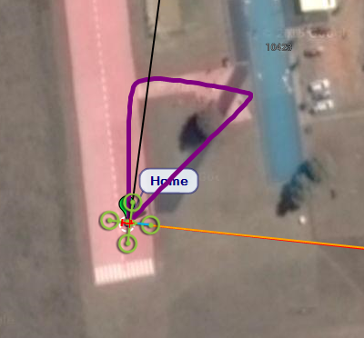

.. _example_simple_goto:

==============================
Example: Simple Go To (Copter)
==============================

This example demonstrates how to arm and launch a Copter in GUIDED mode, travel towards a number of target points, and then return 
to the home location. It uses :py:func:`Vehicle.simple_takeoff() <dronekit.Vehicle.simple_takeoff>`, 
:py:func:`Vehicle.simple_goto() <dronekit.Vehicle.simple_goto>` and :py:attr:`Vehicle.mode <dronekit.Vehicle.mode>`.

The target locations are centered around the home location when the :ref:`Simulated Vehicle <vagrant-sitl-from-full-image>` is booted; 
you can edit the latitude and longitude to use more appropriate positions for your own vehicle. 

.. note:: 

    This example will only run on *Copter*:

    * *Plane* does not support ``takeoff`` in GUIDED mode. 
    * *Rover* will ignore the ``takeoff`` command and will then stick at the altitude check.
   

   Simple Goto Example: Flight path
   
   

Running the example
===================

The example can be run as described in :doc:`running_examples` (which in turn assumes that the vehicle
and DroneKit have been set up as described in :ref:`installing_dronekit`).

In summary, after cloning the repository:

#. Navigate to the example folder as shown:

   .. code-block:: bash

       cd dronekit-python/examples/simple_goto/
       
#. You can run the example against a simulator (DroneKit-SITL) by specifying the Python script without any arguments. 
   The example will download SITL binaries if needed, start the simulator, and then connect to it:

   .. code-block:: bash

       python simple_goto.py

   On the command prompt you should see (something like):
   
   .. code:: bash

       Starting copter simulator (SITL)
       SITL already Downloaded.
       Connecting to vehicle on: tcp:127.0.0.1:5760
       >>> APM:Copter V3.3 (d6053245)
       >>> Frame: QUAD
       >>> Calibrating barometer
       >>> Initialising APM...
       >>> barometer calibration complete
       >>> GROUND START
       Basic pre-arm checks
        Waiting for vehicle to initialise...
        ...
        Waiting for vehicle to initialise...
       Arming motors
        Waiting for arming...
        ...
        Waiting for arming...
       >>> ARMING MOTORS
       >>> GROUND START
        Waiting for arming...
       >>> Initialising APM...
       Taking off!
        Altitude:  0.0
        ...
        Altitude:  7.4
        Altitude:  9.0
        Altitude:  9.65
       Reached target altitude
       Set default/target airspeed to 3
       Going towards first point for 30 seconds ...
       Going towards second point for 30 seconds (groundspeed set to 10 m/s) ...
       Returning to Launch
       Close vehicle object
       
   .. tip::

       It is more interesting to watch the example run on a map than the console. The topic :ref:`viewing_uav_on_map` 
       explains how to set up *Mission Planner* to view a vehicle running on the simulator (SITL).
       
#. You can run the example against a specific connection (simulated or otherwise) by passing the :ref:`connection string <get_started_connect_string>` for your vehicle in the ``--connect`` parameter. 

   For example, to connect to SITL running on UDP port 14550 on your local computer:

   .. code-block:: bash

       python simple_goto.py --connect 127.0.0.1:14550

How does it work?
=================

The code has three distinct sections: arming and takeoff, flight to two locations, and return-to-home.

Takeoff
-------

To launch *Copter* you need to first check that the vehicle :py:func:`Vehicle.is_armable <dronekit.Vehicle.is_armable>`. 
Then set the mode to ``GUIDED``, arm the vehicle, and call 
:py:func:`Vehicle.simple_takeoff() <dronekit.Vehicle.simple_takeoff>`. The takeoff code in this example
is explained in the guide topic :ref:`taking-off`.

Flying to a point - simple_goto
-------------------------------

The vehicle is already in ``GUIDED`` mode, so to send it to a certain point we just need to 
call :py:func:`Vehicle.simple_goto() <dronekit.Vehicle.simple_goto>` with the target 
:py:class:`dronekit.LocationGlobalRelative`:

.. code-block:: python

    # set the default travel speed
    vehicle.airspeed=3

    point1 = LocationGlobalRelative(-35.361354, 149.165218, 20)
    vehicle.simple_goto(point1)

    # sleep so we can see the change in map
    time.sleep(30)

.. tip:: 

    Without some sort of "wait" the next command would be executed immediately. In this example we just 
    sleep for 30 seconds before executing the next command.

When moving towards the first point we set the airspeed using the :py:attr:`Vehicle.airspeed <dronekit.Vehicle.airspeed>` 
attribute. For the second point the example specifies the target groundspeed when calling 
:py:func:`Vehicle.simple_goto() <dronekit.Vehicle.simple_goto>`

.. code-block:: python

    vehicle.simple_goto(point2, groundspeed=10)

.. tip::

    The script doesn't report anything during the sleep periods, 
    but you can observe the vehicle's movement on a ground station map.

RTL - Return to launch
----------------------

To return to the home position and land, we set the mode to ``RTL``.
The vehicle travels at the previously set default speed:

.. code-block:: python

    vehicle.mode    = VehicleMode("RTL")

Source code
===========

The full source code at documentation build-time is listed below 
(`current version on Github <https://github.com/dronekit/dronekit-python/blob/master/examples/simple_goto/simple_goto.py>`_):

.. literalinclude:: ../../examples/simple_goto/simple_goto.py
    :language: python