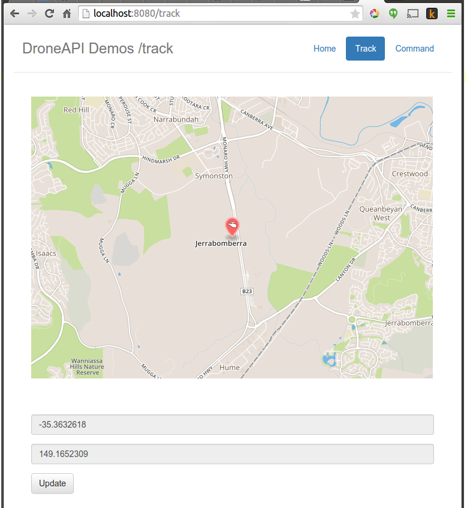
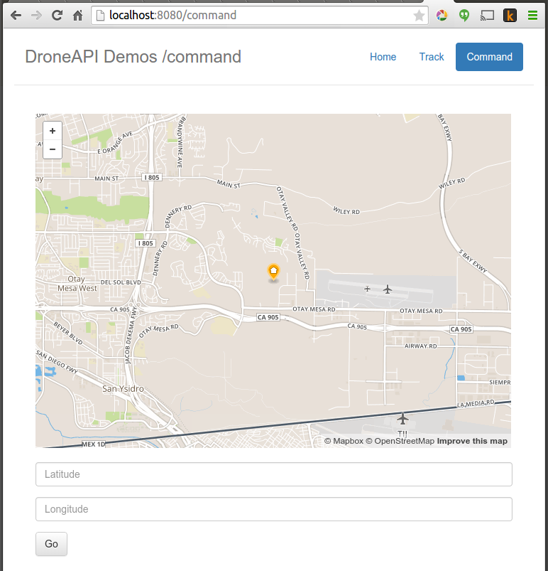

# Drone Delivery Demo

This demonstration is a bit more extensive.  It is a [CherryPy](http://www.cherrypy.org) based web application that mapbox map to let you view the current vehicle position and send the vehicle commands to fly to a particular latitude longitude.

New functionality demonstrated here includes:
* Using attribute observers to be notified of vehicle state changes.
* Starting cherrypy from a DroneAPI application

## Starting the demo

The demonstration is started similar to the previous tutorials.  You should see output that looks like the following:

<pre>
 GUIDED> api start drone_delivery.py
GUIDED> [DEBUG]: DroneDelivery Start
[DEBUG]: Waiting for GPS Lock
[DEBUG]: DroneDelivery Armed Callback
[DEBUG]: GPS: GPSInfo:fix=3,num_sat=10
[DEBUG]: Running initial boot sequence
[DEBUG]: Arming
[DEBUG]: Taking off
[DEBUG]: Mode: GUIDED
INFO:cherrypy.error:[03/Mar/2015:14:29:01] ENGINE Bus STARTING
INFO:cherrypy.error:[03/Mar/2015:14:29:01] ENGINE Started monitor thread '_TimeoutMonitor'.
INFO:cherrypy.error:[03/Mar/2015:14:29:01] ENGINE Started monitor thread 'Autoreloader'.
INFO:cherrypy.error:[03/Mar/2015:14:29:01] ENGINE Serving on http://0.0.0.0:8080
INFO:cherrypy.error:[03/Mar/2015:14:29:01] ENGINE Bus STARTED
ARMED
GPS lock at 0 meters
</pre>

## Screenshots

You should be able to reach your new webserver at http://localhost:8080.  It will look like  the following:

## Looking at the code

### Using attribute observers

All attributes in DroneAPI can have observers - this is the primary mechanism you should use to be notified of changes in vehicle state.  For instance, [drone_delivery.py](../drone_delivery/drone_delivery.py) calls:

<pre>
self.vehicle.add_attribute_observer('location', self.location_callback)

...

    def location_callback(self, location):
        location = self.vehicle.location

        if location.alt is not None:
            self.altitude = location.alt

        self.current_location = location
</pre>

This results in DroneAPI calling our location_callback method any time the location attribute gets changed.

### Starting cherrypy from a DroneAPI application

We start running a web server by calling cherrypy.engine.start().

CherryPy is a very small and simple webserver.  It is probably best to refer to their eight line [tutorial](http://www.cherrypy.org/) for more information.

